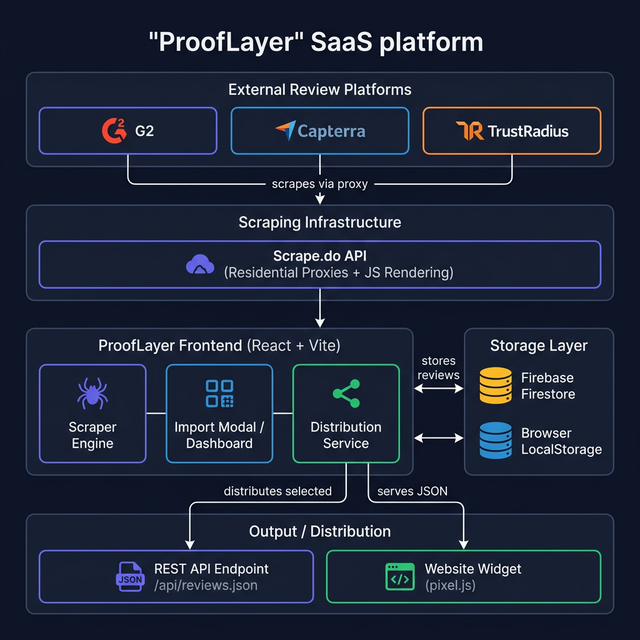
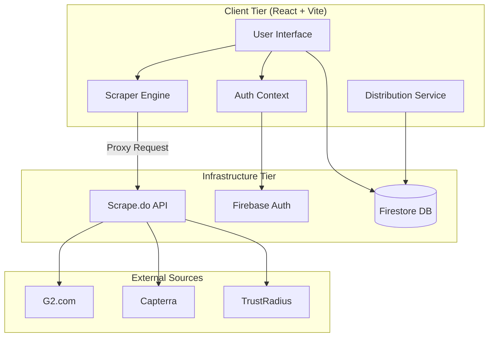
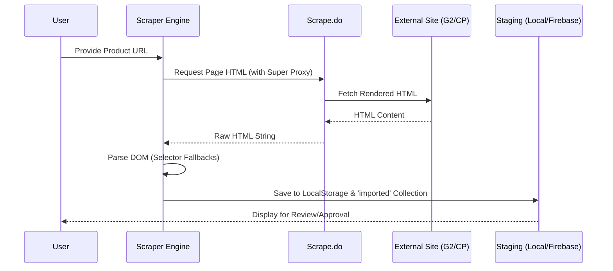

# ProofLayer System Architecture

This document provides a detailed technical overview of the ProofLayer platform architecture, data flow, and integration patterns.

## 1. High-Level Architecture

ProofLayer is a serverless React application that leverages Firebase for persistence and Scrape.do for managed web scraping.

## 2. Scraping Data Flow (Sequence Diagram)

When a user initiates an import, the following sequence occurs:

## 3. The "Selective Sharing" Mechanism

ProofLayer uses a staging-to-live workflow to ensure only high-quality testimonials are displayed publicly.

1.  **Staging (`imported` common)**: Raw reviews fetched from the web.
2.  **Dashboard (`testimonials` collection)**: Approved reviews.
3.  **API Distribution (`isDistributed: true`)**: A flag in the `testimonials` collection that determines if a review is exposed via the public REST Endpoint or Widget.

## 4. Technical Stack Details

| Component | Technology | Role |
| :--- | :--- | :--- |
| **Frontend Framework** | React 19 (Vite) | Core App Shell |
| **Authentication** | Firebase Auth | User identity and RBAC |
| **Database** | Cloud Firestore | Persistent storage for reviews |
| **Scraping Proxy** | Scrape.do | Residential IP rotation & JS Rendering |
| **Storage** | Browser LocalStorage | Local caching for "Zero-Loss" imports |
| **Styling** | Vanilla CSS + Tailwind | Premium Responsive UI |

## 5. Security & RBAC

*   **Security Rules**: Firestore rules restrict `testimonials` deletion to specific roles (Admin/Moderator).
*   **Scraping Tokens**: The Scrape.do token is kept in utility files (should move to `.env` for production).
*   **Data Integrity**: Source URLs and `importedAt` timestamps are strictly maintained to track data provenance.
