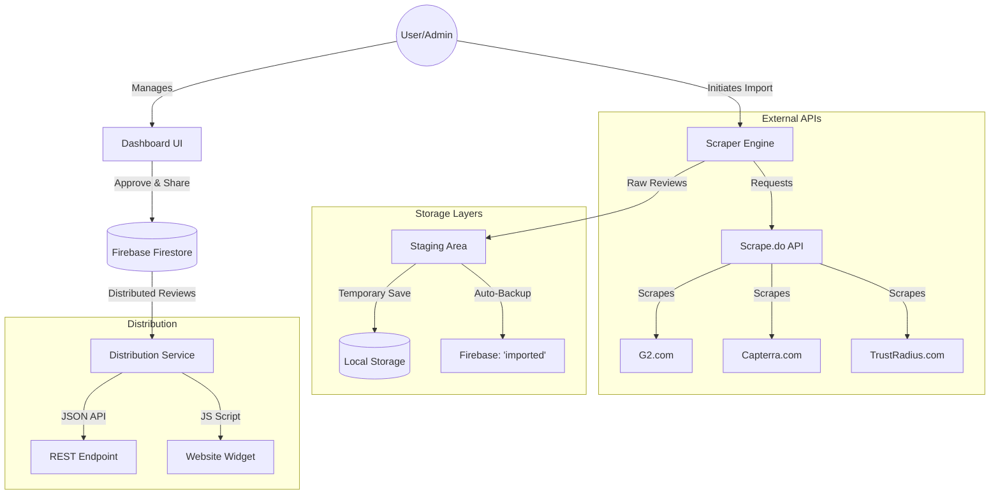

# ProofLayer 🚀

ProofLayer is a powerful platform designed to help businesses collect, manage, and distribute customer testimonials from major review platforms like G2, Capterra, and TrustRadius.

## 🏗️ System Architecture

ProofLayer follows a modern, serverless architecture built on React and Firebase, with a robust scraping engine integrated directly into the frontend.



---

## 🛠️ Core Technology Stack

*   **Frontend**: React (Vite)
*   **Styling**: Vanilla CSS + Tailwind
*   **Authentication**: Firebase Auth
*   **Database**: Firebase Firestore
*   **Scraping**: Scrape.do API (Residential Proxies + Browser Rendering)
*   **Icons**: React Icons (FontAwesome / Bootstrap)

---

## 📂 Project Structure

```text
src/
├── components/          # Reusable UI (Cards, Modals, Sidebar)
├── contexts/            # Authentication & State Management
├── data/                # Mock data & Static assets
├── firebase/            # Firebase config & initialization
├── pages/               # Main view components (Dashboard, Import, Distribute)
├── services/            # Business logic (Distribution, API Fetching)
├── utils/               # Utility functions & Scraper Implementations
│   ├── g2Scraper.js
│   ├── capterraScraper.js
│   └── trustRadiusScraper.js
└── constants/           # Role-based permissions & App-wide config
```

---

## ⚙️ Key Features

### 1. Robust Scraping Engine
Our scrapers are designed with multiple selector fallbacks and residential proxy rotation via Scrape.do. They handle:
*   Pagination (Up to 5+ pages)
*   Reviewer Avatar extraction
*   Content normalization
*   Rating conversion

### 2. Double-Staging Import System
To ensure data safety and smooth UX, reviews are saved to both **LocalStorage** and **Firebase** simultaneously during import. This prevents data loss if a network error occurs.

### 3. Selective Sharing (API/Widget)
You have full control over your social proof. Only reviews marked as **"Shared"** on the dashboard are distributed to your public API endpoint and the website widget.

### 4. Role-Based Access Control (RBAC)
Support for multiple roles (Admin, Moderator, Member) to control who can import, approve, or delete testimonials.

---

## 🚀 Getting Started

1.  **Install Dependencies**:
    ```bash
    npm install
    ```

2.  **Environment Setup**:
    Create a `.env` file with your Firebase and Scrape.do configurations.

3.  **Run Locally**:
    ```bash
    npm run dev
    ```

4.  **Build for Production**:
    ```bash
    npm run build
    ```

---

## 📝 License
Proprietary - Developed for ProofLayer.
